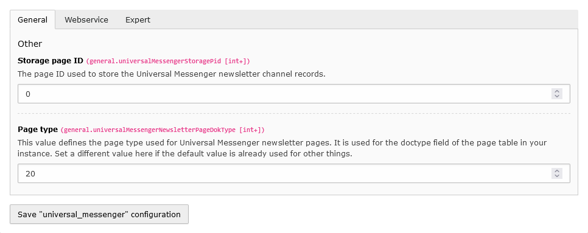
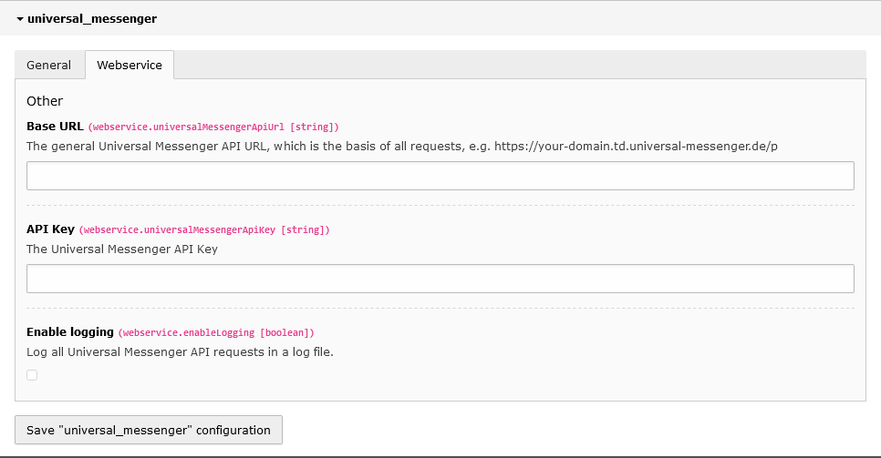
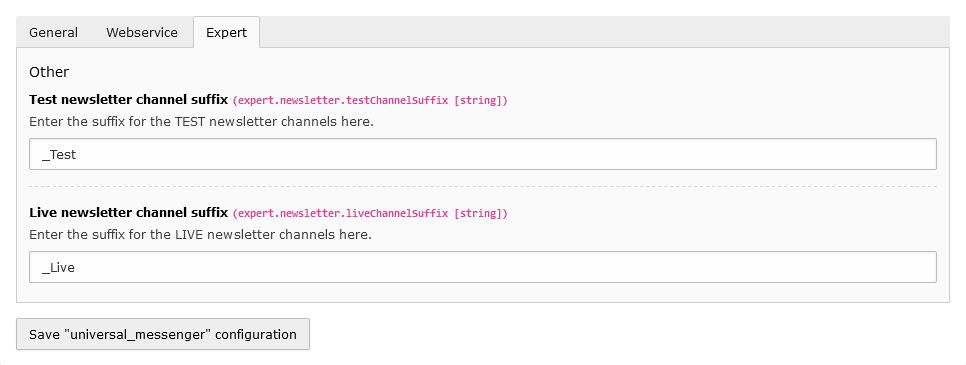
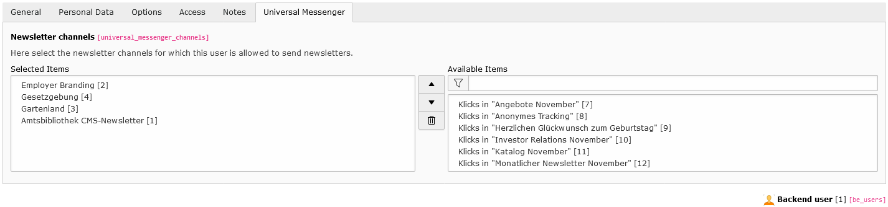
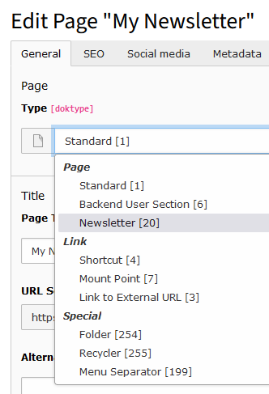
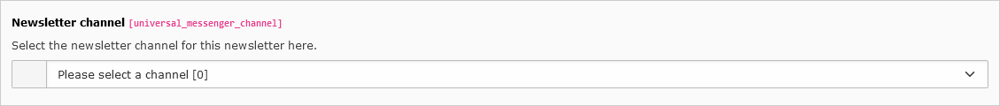
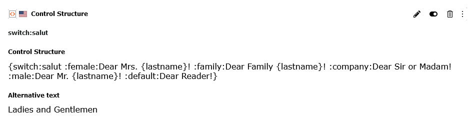
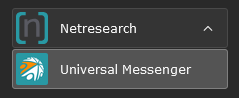
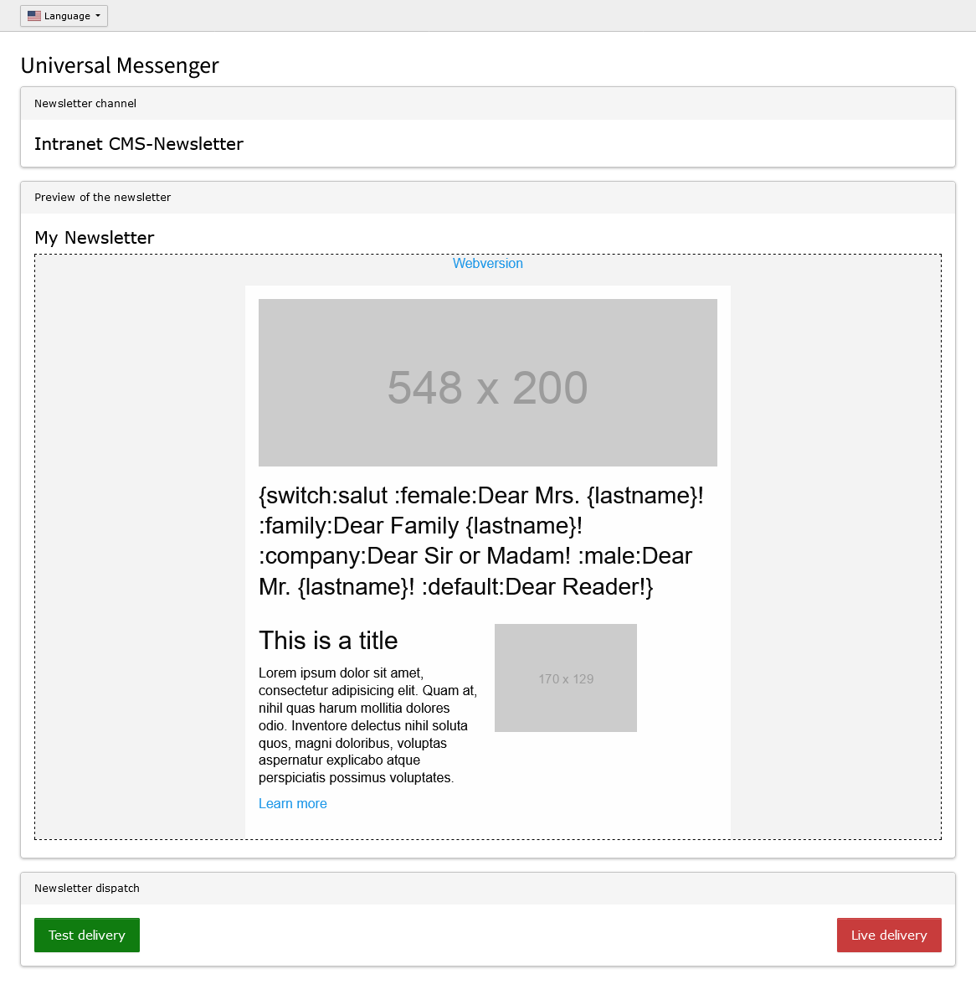

[](https://github.com/netresearch/universal-messenger/releases/latest)
[](https://github.com/netresearch/universal-messenger/blob/main/LICENSE)
[](https://github.com/netresearch/universal-messenger/actions/workflows/ci.yml)

# Universal Messenger
A TYPO3 extension that provides a TYPO3 backend module to send TYPO3 pages as newsletters using the Universal Messenger API.


<!-- TOC -->
  * [Installation](#installation)
  * [Setup](#setup)
    * [Update database structure](#update-database-structure)
    * [Webservice](#webservice)
      * [API endpoint](#api-endpoint)
    * [Extension configuration](#extension-configuration)
      * [General](#general)
      * [Webservice](#webservice-1)
        * [API logging](#api-logging)
      * [Expert](#expert)
        * [Test-/Live channels](#test-live-channels)
    * [Backend user configuration](#backend-user-configuration)
    * [TypoScript](#typoscript)
    * [Scheduler-Task](#scheduler-task)
  * [Usage](#usage)
  * [Creating newsletters](#creating-newsletters)
    * [Content elements](#content-elements)
      * [Control structure](#control-structure)
  * [Development](#development)
    * [Testing](#testing)
<!-- TOC -->


## Installation
The extension should be installed via composer:

``composer require netresearch/universal-messenger``


## Setup
### Update database structure
Use the `Analyze Database Structure` in the `Maintenance` Admin Tools section to update the database structure.

### Webservice

#### API endpoint
To access the Universal Messenger API, store the corresponding configuration in the file `additional.php` within the
global structure `TYPO3_CONF_VARS` under `EXTENSIONS` and `universal_messenger` (note the spelling) of your TYPO3 installation.

```php

// The universal messenger API endpoint
$GLOBALS['TYPO3_CONF_VARS']['EXTENSIONS']['universal_messenger'] = array_merge(
    $GLOBALS['TYPO3_CONF_VARS']['EXTENSIONS']['universal_messenger'] ?? [],
    [
        'apiUrl' => 'YOUR-API-URL',
        'apiKey' => 'YOUR-API-KEY',
    ]
);
```

| Field  | Description                                                                                                                        |
|:-------|:-----------------------------------------------------------------------------------------------------------------------------------|
| apiUrl | Your general Universal Messenger API URL, which is the basis of all requests, e.g. https://your-domain.td.universal-messenger.de/p |
| apiKey | Your Universal Messenger API key                                                                                                   |


### Extension configuration
Open the `Settings` page under the `Admin Tools` section and switch to the `Extension Configuration`. Open the
configuration section of the extension `universal_messenger`.

#### General


*Fig. 1: Extension Configuration Tab `General`*

| Field                          | Tab        | Default value | Description                                                                                                                                                                                                                            |
|:-------------------------------|:-----------|:--------------|:---------------------------------------------------------------------------------------------------------------------------------------------------------------------------------------------------------------------------------------|
| Storage page ID                | General    | 0             | The page ID used to store the Universal Messenger newsletter channel records.                                                                                                                                                          |
| Page type                      | General    | 20            | This value defines the page type used for Universal Messenger newsletter pages. It is used for the doctype field of the page table in your instance. Set a different value here if the default value is already used for other things. |
| Enable logging                 | Webservice | 0             | Log all Universal Messenger API requests in a log file.                                                                                                                                                                                |
| Test newsletter channel suffix | Expert     | _Test         | Enter the suffix for the TEST newsletter channels here.                                                                                                                                                                                |
| Live newsletter channel suffix | Expert     | _Live         | Enter the suffix for the LIVE newsletter channels here.                                                                                                                                                                                |


#### Webservice

*Fig. 2: Extension Configuration Tab `Webservice`*

##### API logging
To enable the request/response logging of the Universal Messenger, enable the extension configuration `Enable logging`
and add a log writer configuration to your `ext_localconf.php`:

```php
// Add logger for universal messenger
$GLOBALS['TYPO3_CONF_VARS']['LOG']['Netresearch']['UniversalMessenger']['writerConfiguration'] = [
    \Psr\Log\LogLevel::DEBUG => [
        \TYPO3\CMS\Core\Log\Writer\FileWriter::class => [
            'logFileInfix' => 'universal_messenger',
        ],
    ],
];
```

#### Expert

*Fig. 3: Extension Configuration Tab `Expert`*

##### Test-/Live channels
To enable test operation, a separate channel can be set up as a test channel for a newsletter in
Universal Messenger and, for example, given a suffix.

Test operation
- Channel: Newsletter_TEST
- Recipient: Defined recipient list for validating the newsletter before it is actually sent to customers.

Live operation
- Channel: Newsletter_LIVE
- Recipient: Recipient list with customer addresses

Using the setting `newsletter` => `testChannelSuffix` and `liveChannelSuffix`, this suffix can be
adapted to the setting in Universal Messenger.


### Backend user configuration
Use the backend user setting in the `Universal Messenger` tab to allow individual backend users specific rights 
for sending via individual newsletter channels.


*Fig. 4: Backend user configuration*


### TypoScript
Go to the `TypoScript` page, select `Edit TypoScript Record` and then click `Edit the whole TypoScript record`. On the
page that opens, go to the `Advanced Options` tab and add the static TypoScript
`Universal Messenger: Fluid Content Elements` to the list of selected TypoScript configurations.

When creating a newsletter, the CSS is finally read from an external CSS file and the information is added as
inline style attributes to the respective HTML elements.

By setting the `inlineCssFiles` setting, additional CSS can be passed to the newsletter container. By default,
the CSS of the `Foundation for Emails 2` framework is already included (https://get.foundation/emails.html, https://github.com/foundation/foundation-emails).

```typo3_typoscript
plugin.tx_universalmessenger {
    settings {
        inlineCssFiles {
            10 = EXT:universal_messenger/Resources/Public/Css/ZurbFoundation.css
            20 = EXT:<YOUR-EXTENTSION>/Resources/Private/Css/<YOUR-CSS-FILE>.css
        }
    }
}

module.tx_universalmessenger < plugin.tx_universalmessenger
```


#### Example backend layout
Go to the `TypoScript` page, select `Edit TypoScript Record` and then click `Edit the whole TypoScript record`. On the
page that opens, go to the `Advanced Options` tab and add the static TypoScript
`Universal Messenger: Example Newsletter Template` to the list of selected TypoScript configurations.

Open a page where you want to use the backend layout and switch to page properties and select `resources` tab and add
`Universal Messenger: Backend Layout` to the `Page TSconfig` selection.

Now you can select the backend layout in the `layout` tab.


### Scheduler-Task
The extension provides a console command `universal-messenger:newsletter-channels:import` for importing the
Universal Messenger newsletter channels. This command can be configured as a scheduler task to automatically load the
newsletter channels into TYPO3 once a day, for example.


## Usage
### Basic
The newsletter channels are imported into TYPO3 as generic channels, i.e. the configured suffixes for the
test or live channels are cut off (regardless of the spelling, i.e. an upper and lower case is ignored).

A newsletter page is always assigned only the generic channel name, and the separation after a TEST or LIVE
dispatch only takes place in the dispatch module.

Each newsletter channel can also be configured with additional settings (a new import does not overwrite these settings):

| Field                  | Default value | Description                                                                                                      |
|:-----------------------|:--------------|:-----------------------------------------------------------------------------------------------------------------|
| Sender email address   |               | The sender's email address. If set, this overwrites the sender ID preset in the configuration file.              |
| Reply-to email address |               | The reply-to email address. If set, this overwrites the reply-to ID preset in the configuration file.            |
| Skip used ID           | 0             | Enable if the sending should be canceled if there is already a newsletter with the same event ID in the archive. |
| Embed images           | none          | Behavior for embedding images.                                                                                   |

These settings are sent to the Universal Messenger API when the newsletter page is submitted.


### Creating newsletters
To create a new newsletter, simply create a new page in the TYPO3 backend. To do this, use the new shortcut
`Newsletter` in the page tree or create a new standard page.


Then open the page properties. For a standard page, select the new page type `Newsletter`.



The page will then reload and the selection for the Universal Messenger newsletter channel will appear below the
selection for the page type. Select the appropriate channel for sending the newsletter here.



Create your newsletter with the usual TYPO3 content elements. If necessary, use a container framework such
as https://extensions.typo3.org/extension/container_elements to group elements more easily into columns and rows.

The Universal Messenger Extension already provides some ViewHelpers to group and arrange elements according to
the `Foundation for Emails 2` framework (See https://get.foundation/emails.html how to create newsletters using
this framework).


### Content elements
The extension also provides content elements for use with the Universal Messenger API.

#### Control structure
In the settings of the content element, you enter the corresponding control structure (e.g. personalized salutation)
of the Universal Messenger. You also specify the alternative that is displayed if the newsletter is displayed in the
web view, for examp le, and personalization is not available.



Both the control structure and the alternative can be formatted using the RTE editor and thus adapted to the layout of the newsletter.


### View helpers
#### Initialization
To use the ViewHelpers provided by the extension, they must be made known within the HTML using the namespace
`xmlns:um="http://typo3.org/ns/Netresearch/UniversalMessenger/ViewHelpers"`.

#### View helper "format.placeholder"
To pass additional placeholders within URLs, e.g. the unsubscribe link for newsletters, to the Universal Messenger, the
view helper `um:format.placeholder` can be used to mark a value as a placeholder using curly brackets.

```html
<f:link.external uri="https://newsletter.example.org/unsubscribe?identifier={um:format.placeholder(value: 'identifier')}">Unsubscribe</f:link.external>
```

This results in an URL like `https://newsletter.example.org/unsubscribe?identifier={identifier}`.


### Backend module
To open the backend module, click on the new entry `Universal Messenger` below the `Netresearch` group on the left side navigation.



In the view that now opens, you have the option of selecting the corresponding newsletter page and, assuming you have
the appropriate access rights, you can see a preview of the respective newsletter as it would be transferred to the
Universal Messenger and sent.

A language switcher will appear above the preview if there are multiple versions of a newsletter in different languages.



Below the preview there are two buttons for testing the sending and for the final LIVE sending. The actual LIVE sending
must be confirmed again in a dialog.


## Development
### Testing
```bash
composer install

composer ci:cgl
composer ci:test
composer ci:test:php:phplint
composer ci:test:php:phpstan
composer ci:test:php:rector
```
